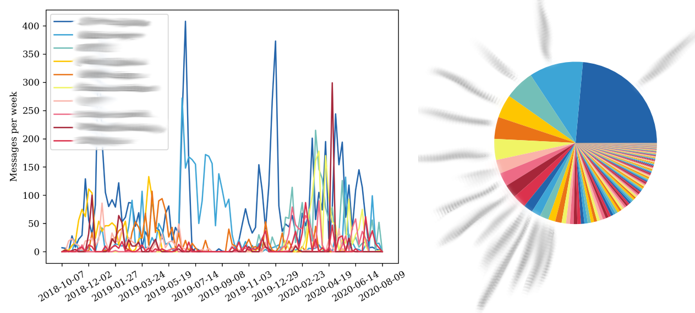

# Facebook Messenger Data Analysis

This is a substantially faster version of [berylha/fb-messenger-analysis](https://github.com/berylha/fb-messenger-analysis), for analyzing direct message data from Facebook Messenger.

## Usage

Download your data from Facebook by going to

    facebook.com > Settings > Your Facebook Information > Download Your Information

Deselect everything other than "Messages", select "Format: JSON", then click "Create File".

After the download is ready (this might take a while), download it and extract the zip folder into the same directory where this program is located.

Run `direct_message_plots.py`, which will produce `top_chats.png`, `top_chats_pie.png`, and `total_messages.png`.
It takes optional arguments to specify the path to the message data folder, how many chats to show, and smoothing.
Run `direct_message_plots.py -h` for details.